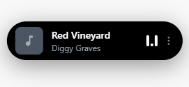
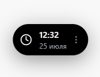
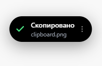
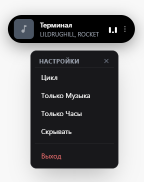

<div align="center">
  
# 🛸 Halo
  
**Dynamic Island для Windows**
  


  
</div>

> **⚠️ Внимание:** Это ранняя **Pre-Release** версия. Проект находится в активной разработке и временно ориентирован на русскоязычных пользователей (СНГ).

Прозрачный, плавный и минималистичный Dynamic Island для рабочего стола Windows. Приложение работает поверх всех окон, перехватывает системные события и отображает их в виде красивой анимированной "пилюли" в стиле Apple.

## 📸 Скриншоты

<div align="center">
  <table>
    <tr>
      <td align="center"><b>🎵 Музыка</b></td>
      <td align="center"><b>⏱ Часы</b></td>
    </tr>
    <tr>
      <td></td>
      <td></td>
    </tr>
    <tr>
      <td align="center"><b>📋 Буфер обмена</b></td>
      <td align="center"><b>⚙️ Настройки</b></td>
    </tr>
    <tr>
      <td></td>
      <td></td>
    </tr>
  </table>
</div>

## ✨ Возможности

- 🎵 **Перехват музыки:** Подхватывает треки из Spotify, Яндекс.Музыки, браузеров (Chrome/Edge) и других плееров, интегрированных с Windows SMTC.
- ⏱ **Часы:** Отображение локального времени и даты.
- 📋 **Буфер обмена:** Всплывающее уведомление при копировании текста (`Ctrl+C`).
- 🖱 **Перетаскивание:** Островок и меню настроек можно двигать мышкой в любое место экрана.
- 👻 **Click-Through:** Прозрачные зоны окна не блокируют рабочий стол — клики проходят насквозь.
- ⚙️ **Режимы отображения:** Цикл, только музыка, только часы или скрытый режим.

## ⚠️ Известные проблемы

- Нет иконки в системном трее (закрыть можно через меню настроек -> Выход).
- Прогресс-бар музыки может дергаться (зависит от плеера).
- Нет автозапуска с системой.

## 🚀 Запуск для разработчиков

```bash
# Клонировать репозиторий
git clone https://github.com/nul1fire/Halo.git

# Установить зависимости
npm install

# Запустить в режиме разработки
npm run dev

# Собрать .exe
npm run build
```

## 📄 Лицензия

Проект распространяется под лицензии MIT.
