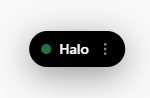
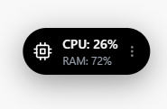

<div align="center">

# 🛸

# 🛸 Halo

**Dynamic Island для Windows — прозрачный, плавный и минималистичный.**

<br />


<br />

> 🚀 **Halo** выводит опыт использования Dynamic Island (как на iPhone) на рабочий стол Windows.  
> Никаких громоздких виджетов. Только чистая эстетика, плавные анимации и системная интеграция.  
> Приложение работает поверх всех окон, перехватывает музыку, время и системные метрики.

<br />

---

</div>

## ✨ Возможности

<div align="center">

<table>
  <tr>
    <td align="center" width="33%">
      <strong>🎵 Музыка (SMTC)</strong><br />
      Управляйте Spotify, Яндекс.Музыкой и браузером прямо из островка
    </td>
    <td align="center" width="33%">
      <strong>⏱ Часы и Дата</strong><br />
      Отображение точного локального времени в реальном времени
    </td>
    <td align="center" width="33%">
      <strong>📊 Система</strong><br />
      Мониторинг загрузки CPU и RAM в фоновом режиме
    </td>
  </tr>
  <tr>
    <td align="center" width="33%">
      <strong>📋 Буфер обмена</strong><br />
      Мгновенные уведомления при копировании текста
    </td>
    <td align="center" width="33%">
      <strong>🖱 Drag & Drop</strong><br />
      Двигайте островок и меню в любое место экрана
    </td>
    <td align="center" width="33%">
      <strong>👻 Click-Through</strong><br />
      Прозрачные зоны не блокируют рабочий стол — клики проходят насквозь
    </td>
  </tr>
</table>

</div>

<br />

<div align="center">

## 📸 Скриншоты

<table>
  <tr>
    <td align="center"><b>Главный экран (Idle)</b></td>
    <td align="center"><b>Музыка</b></td>
  </tr>
  <tr>
    <td></td>
    <td></td>
  </tr>
  <tr>
    <td align="center"><b>Часы</b></td>
    <td align="center"><b>Система (CPU/RAM)</b></td>
  </tr>
  <tr>
    <td></td>
    <td></td>
  </tr>
  <tr>
    <td align="center"><b>Буфер обмена</b></td>
    <td align="center"><b>...</b></td>
  </tr>
  <tr>
    <td></td>
    <td></td>
  </tr>
</table>

</div>

<br />

## 🛠 Технологии

<div align="center">

| Слой | Технологии |
| :---: | :--- |
| **Backend** | Electron, Node.js, PowerShell (WinRT для SMTC) |
| **Frontend** | React 18, TypeScript, Vite |
| **UI / UX** | Tailwind CSS, Framer Motion |

</div>

<br />

## 🚀 Запуск для разработчиков

### Требования

- **Node.js** v18+
- **npm** или **yarn**

### Установка и запуск

```bash
git clone https://github.com/nul1fire/Halo.git
cd Halo
npm install
npm run dev
```

### Сборка для Production

```bash
npm run build
```

<br />

## 🗺 План развития (Roadmap)

### ✅ Готово

- Перехват музыки (Windows SMTC)
- Управление воспроизведением (Play/Pause/Next/Prev)
- Системный трей и автозапуск с Windows
- Часы и буфер обмена
- Виджет загрузки системы (CPU/RAM)

### 🔜 Запланировано

- Настройка горячих клавиш
- Интеграция погоды
- Темная / Светлая темы
- Настройка скорости и поведения анимаций

<br />

<div align="center">

**Лицензия:** MIT

Сделано с ❤️ и ☕

</div>
